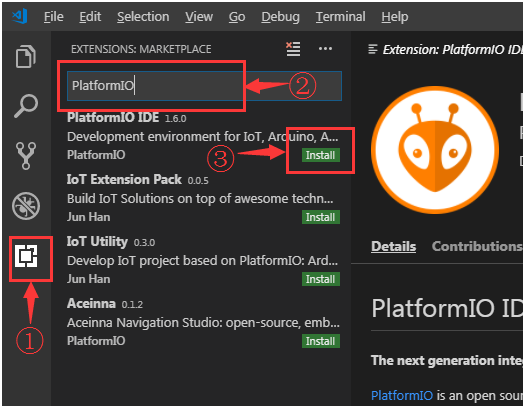
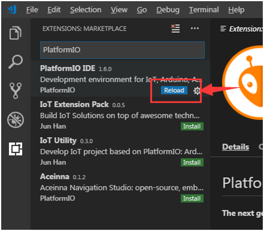
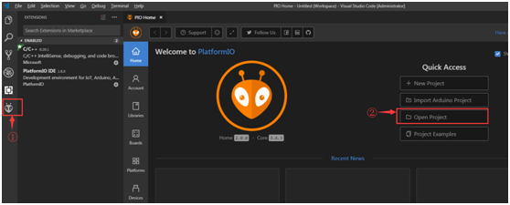
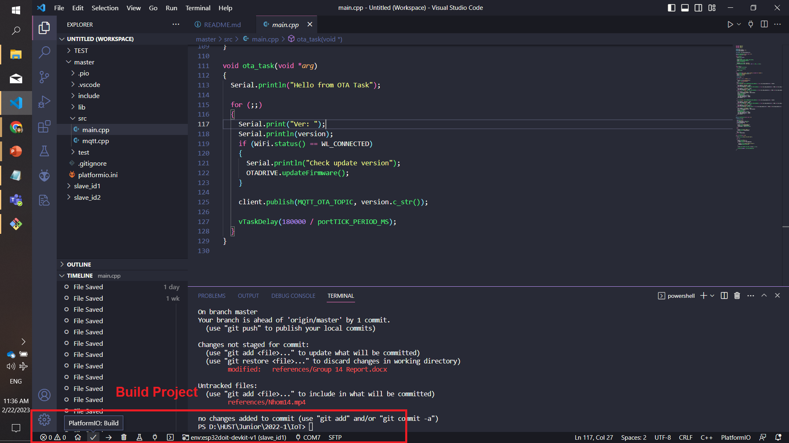
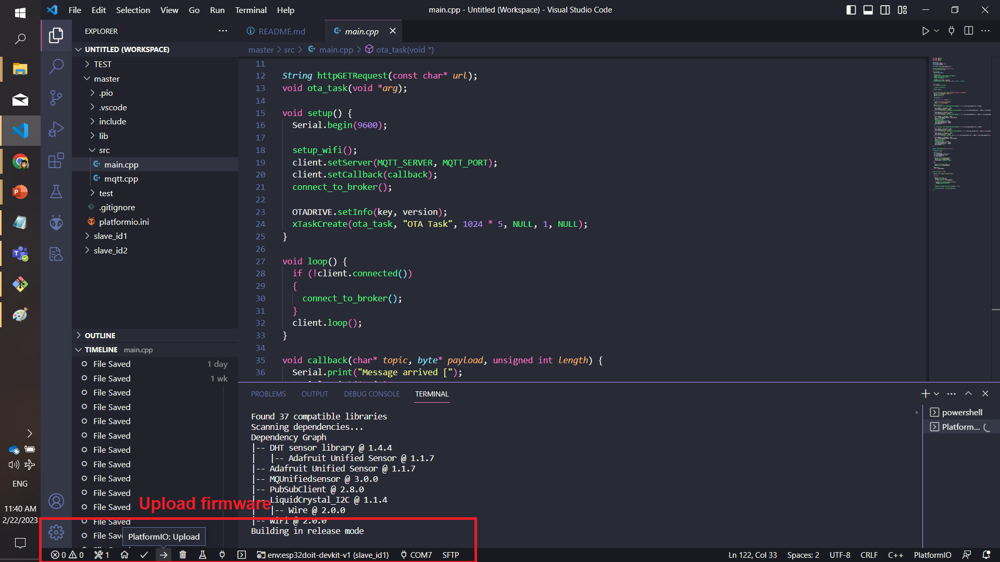
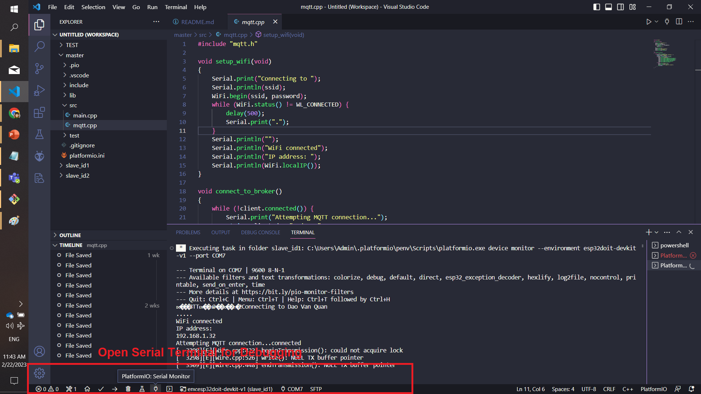

# SmartHome-IoT
# Network and IoT Protocols Assignment
# Source code của Project gồm 3 folder:

## Folder "master": source code for master
## Folder "slave_id1": source code for nodeID1, which includes DHT11, MQ2 sensors and LCD16x02 Display.
## Folder "slave_id2": source code for nodeID1, which includes DHT11, Light sensors and LCD16x02 Display, Relay 1 - channel Module.

# Connections System:
* ESP32:
* Module DHT11:	  GPIO25, VCC(3.3), GND
* Module MQ2:	    GPIO26(Digital), GPIO35(Analog), VCC(3.3), GND
* Module AS:	    GPIO27(Digital), GPIO34(Analog), VCC(3.3), GND
* Module Relay:	  GPIO32(Digital), VCC(VIN-5V), GND
* Module LCD+I2C:	GPIO21(SDA), GPIO22(SCL), VCC(VIN-5V), GND
* Còi:		        GPIO33(Digital), GND

# PlatformIO for compiling my project (Cài đặt IDE cho Project)

Integrate PlatformIO into Visual Studio Code on top of [PlatformIO Core](http://docs.platformio.org/en/stable/core.html).

## Features (Đặc trưng)

* Build PlatformIO project specified in [Project Configuration File platformio.ini](http://docs.platformio.org/en/stable/projectconf.html#projectconf)
* Upload firmware to devices specified in [Project Configuration File platformio.ini](http://docs.platformio.org/en/stable/projectconf.html#projectconf)
* Open Serial Monitor

## Prerequisites (Các bước cài đặt IDE)

* Install [PlatformIO Core](http://docs.platformio.org/en/stable/installation.html)



* After the download is complete, you still need Reload



* After Reload, you will be prompted to install PlatformIO Core, which takes a little time.

* After the installation is successful, you need to reload again. After the Reload, the PlatformIO is installed.

* In the lower left corner of the VSCode, you can see that there’s one more icon, please see the picture(①), which is the PlatformIO plugin, and then click ② Open Project to open the project.



## Setup Project (Các bước setup Project)

### Cloning an existing repository. (Clone project từ github về)

* Determine your HTTP clone url. On Github it's probably something like ***https://github.com/crazyfrog-phongee/StupidHome-IoT.git***. Should be on the project's page somewhere.

		cd ~/Desktop
		git clone {{the link you just copied}} Project
Example: 
        git clone https://github.com/crazyfrog-phongee/StupidHome-IoT.git

* This creates a directory named "Project", clones the repository there and adds a remote named "origin" back to the source.

* Use existing project

  If you have an existing PlatformIO project, open the project folder directly in VS Code

* Create new project

  In terminal, run `platformio init --board <your_board_identifier>` to initialize a new PlatformIO project, then open the project folder in VS Code. Refer to [User Guide](http://docs.platformio.org/en/stable/userguide/cmd_init.html) for `platformio init` command. For how to find Board Identifier, you could refer to [this](http://docs.platformio.org/en/stable/quickstart.html#board-identifier).*

## Usage (Các bước build và nạp code cho hệ thống)

* **Build PlatformIO project**: use shortcut `Ctrl+Alt+B`, or press `F1` and then select/type `PlatformIO: Build`, or right click the Text Editor and then click `PlatformIO: Build` in context menu



* **Upload firmware to devices**: use shortcut `Ctrl+Alt+u`, or press `F1` and then select/type `PlatformIO: Upload`, or right click the Text Editor and then click `PlatformIO: Upload` in context menu



* **Open Serial Monitor**: use shortcut `Ctrl+Alt+S`, or press `F1` and then select/type `PlatformIO: Open Serial Monitor`, or right click the Text Editor and then click `PlatformIO: Open Serial Monitor` in context menu



## Edit Serial Monitor Frequency (Thay đổi tần số Serial)

By default, the serial monitor frequency is rate 9600Hz. To change it, update the platform.ini as below:
```json
{
    "monitor_speed": <value>
}
```

## Issues

Currently, the extension is in the very initial phase. If you find any bug or have any suggestion/feature request, please join the chat on [Linkedin](https://www.linkedin.com/in/phong-nguy%E1%BB%85n-tr%E1%BB%8Dng-94726a246/)
